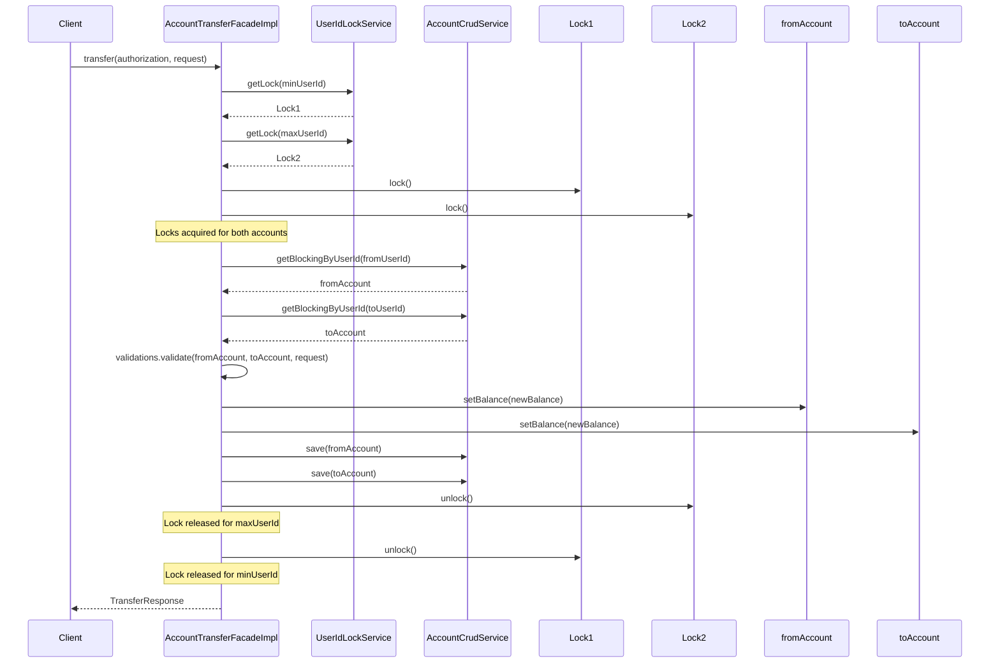
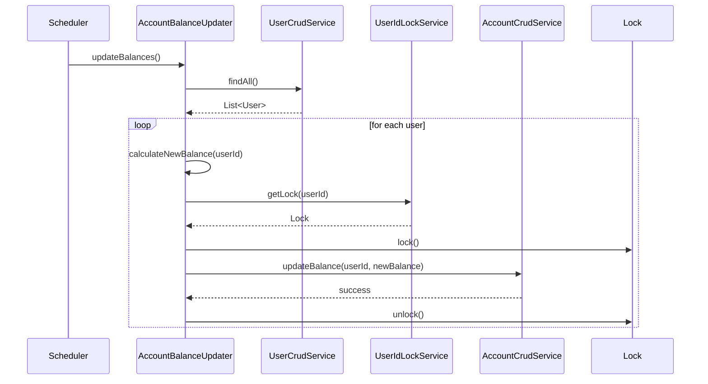

# Locking System Explanation

## Account Transfer Locking System

```mermaid
sequenceDiagram
    participant Client
    participant AccountTransferFacadeImpl
    participant UserIdLockService
    participant AccountCrudService
    Client->>AccountTransferFacadeImpl: transfer(authorization, request)
    AccountTransferFacadeImpl->>UserIdLockService: getLock(minUserId)
    UserIdLockService-->>AccountTransferFacadeImpl: Lock1
    AccountTransferFacadeImpl->>UserIdLockService: getLock(maxUserId)
    UserIdLockService-->>AccountTransferFacadeImpl: Lock2
    AccountTransferFacadeImpl->>Lock1: lock()
    AccountTransferFacadeImpl->>Lock2: lock()
    Note over AccountTransferFacadeImpl: Locks acquired for both accounts
    AccountTransferFacadeImpl->>AccountCrudService: getBlockingByUserId(fromUserId)
    AccountCrudService-->>AccountTransferFacadeImpl: fromAccount
    AccountTransferFacadeImpl->>AccountCrudService: getBlockingByUserId(toUserId)
    AccountCrudService-->>AccountTransferFacadeImpl: toAccount
    AccountTransferFacadeImpl->>AccountTransferFacadeImpl: validations.validate(fromAccount, toAccount, request)
    AccountTransferFacadeImpl->>fromAccount: setBalance(newBalance)
    AccountTransferFacadeImpl->>toAccount: setBalance(newBalance)
    AccountTransferFacadeImpl->>AccountCrudService: save(fromAccount)
    AccountTransferFacadeImpl->>AccountCrudService: save(toAccount)
    AccountTransferFacadeImpl->>Lock2: unlock()
    Note over AccountTransferFacadeImpl: Lock released for maxUserId
    AccountTransferFacadeImpl->>Lock1: unlock()
    Note over AccountTransferFacadeImpl: Lock released for minUserId
    AccountTransferFacadeImpl-->>Client: TransferResponse
```

## Account Balance Updater Locking System

```mermaid
sequenceDiagram
    participant Scheduler
    participant AccountBalanceUpdater
    participant UserCrudService
    participant UserIdLockService
    participant AccountCrudService

    Scheduler->>AccountBalanceUpdater: updateBalances()
    AccountBalanceUpdater->>UserCrudService: findAll()
    UserCrudService-->>AccountBalanceUpdater: List<User>

    loop for each user
        AccountBalanceUpdater->>AccountBalanceUpdater: calculateNewBalance(userId)
        AccountBalanceUpdater->>UserIdLockService: getLock(userId)
        UserIdLockService-->>AccountBalanceUpdater: Lock
        AccountBalanceUpdater->>Lock: lock()
        AccountBalanceUpdater->>AccountCrudService: updateBalance(userId, newBalance)
        AccountCrudService-->>AccountBalanceUpdater: success
        AccountBalanceUpdater->>Lock: unlock()
    end
```
